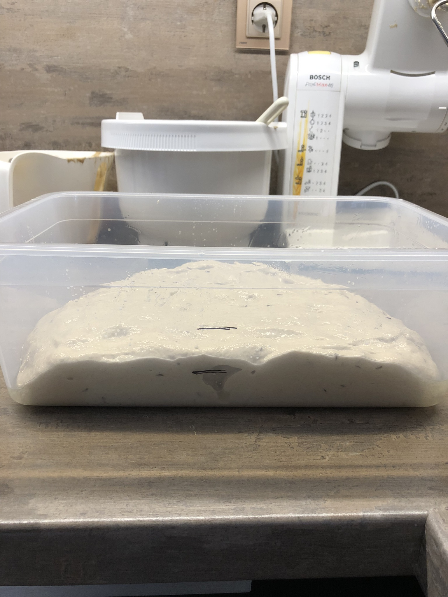

# Bára peče chleba

### kvas:

150g kvasu (30g kvásku, 60 g vody + 60 g žitné mouky)

### těsto:

##### suché:

15g sůl

7g kmín

500g chlebové pšeničné mouky

100g žitné mouky

##### mokré:
400g vody (28°C)

##### navíc:
rýžová mouka

##### potřeby:

minutka (nejlepší jsou na to apple watch)

větší mísa

menší mísa

ošatka (nebo cedník s utěrkou, nebo mísa s utěrkou), zaprášená rýžovou moukou

silikonová / gumová stěrka

rozprašovač s vodou

žiletka na špejli (nebo hodně ostrý nožík)

prkénko / malý plech bez okraje / sázecí lopatka

pečící papír

plech na pečení

malý pekáček na odpařování vody

trouba

##### hodí se taky:

kuchyňský robot

zapichovací teploměr

mísa s hranatými stěnami

olej

fixa

mrížka na chladnutí chleba (třeba ta z trouby)

## rychlý recept:

### 1. den: 

Odpoledne nakrmit kvásek půlkou mouky a vody, večer nakrmit zbytkem. Nechat do druhého dne do rána.

### 2. den:

Smíchat těsto dokud v něm nejsou žádné suché části (cca 1min ručně, nebo 3-4 min v robotu). Nechat 2 hodiny pod utěrkou odpočinout. 

Po 2 hodinách hníst 10 minut. Ručně tak ze těsto vytahuju a překládám, nebo robotem na vyšší rychlost.

Nechat 30min, potom zpřehýbat a přendat do hranaté nádoby vymazané olejem. Přehýbat každých 30 min, dokud nevykyne o 75%. Teplota ideálně 28-30 °C .

Vytvarovat, posypat rýžovou moukou a do ošatky. 

Ošatku volně obalit potravinovou fólií, a do lednice (nejlépe dolu kde je nejvíc zima). 

V lednici přes noc, nebo aspoň 5 hodin.

### 3. den: 

Rozehřát troubu na 250, spodní i horní ohřev. Plech na pečení do spodní třetiny. A dolu malý pekáček na vodu.Těsto vyklopit na pečící papír na prkénku, nakrojit, notně postříkat vodou, a dát péct. Do spodního pekáčku nalít 150ml horké vody.

17 min na 250 °C s odpařováním. Potom vyndat pekáček, a 30 min na 190 °C.

Vyklopit na mřížku, opatrně odstranit pečící papír. Nechat 2h vychladnout.

## podrobný recept:

> ℹ️ Já vetšinou peču dva chleby najednou protože to je maximum co pobere mixér, a nemusím pak uklízet po pečení každý druhý den. Navíc první chleba se většinou sní už první večer. Kdyby ne tak se buď dá druhý upéct jen do púlky a pak zamrazit. A nebo je z něj skvělej zapečenej chleba i po tejdnu.

### 1 týden pred pečením: 

Vyndej trochu sušeného kvásku z mrazáku a nakrm ho 15g žitné mouky a 15g vlažné vody, takhle to dělej nekolik dní. Vždycky půlku nebo víc vyhoď, a pak ho nakrm. Měl by postupně pres den začít kvasit na cca dvojnasobek objemu. Pokud je to výrazně víc potřebuje si nejspíš zvyknout na novou mouku. Pokud je to výrazně míň tak je něco špatně.

Po týdnu ho dej v čisté sklenici do lednice, tam bude žít. Stačí ho pak dokrmit jen jednou za týden a nebude plesnivět. Já když nepeču tak většinu vyleju do koše, tak že ve sklenici zůstane jen po dně a k tomu od oka dosypu žitnou mouku a doleju vodu, trochu to promíchám a šup zpět do lednice.

### 1 den před zaděláváním:

Odpoledne vyndám část kvásku z lednice. Kvásek v lednici nakrmím a vrátím ho zpátky do lednice. A druhou část nakrmím cca třetinou z množství na výsledný kvas. Večer potom dokrmím zbytkem a nechám přes noc kvasit v zakryté nádobě.

Kvásek první den večer:

> ℹ️ Jako nádobu teď většinou používám střední mísu (asi dvakrát větší než na fotce), a kvasu si udělám trochu víc, protože ze zbytku jsou pak super lívance, které se mi vejdou do té mísy od kvasu. Dělám tyhle <https://kitchenette.cz/clanek/167-kvaskove-livance>, ale bez chia. Jen pozor pokud vaříš jako já bez čtení postupů, to vejce co tam píšou se dává až druhý den (i když teda nevim proč, je to stejně v lednici a funguje to tak jako tak.). Smažím to pak během pečení chleba na hodně malou teplotu (u nás na indukci na stupeň 8 z 14, 4 min z jedné strany a 2 min z druhé).

### zaděláváni:

#### 8:00

Ráno cca v 8 by měl být kvas pěkně rozkypěný, bude ho as tak dvakrát víc než večer. Na stěně mísy ve které kvasil je vidět že vykypěl a potom začal zase ustupovat. Ideálně by měl člověk zadělávat zrovna když kvásek začíná ustupovat, protože je na vrcholu sil.

Kvásek druhý den ráno:

Všechny ingredience dám do robotu a nechám promíchat, vetšinou první vodu (28 °C), potom kvas a na to suché, protože se to dole nepřilepí k té míse, a nahoře se mi nenaplácá nenaplácá kvásek na robot, ale jen se ušpiní od mouky.

Ideální je si suché ingredience nejdřív promíchat v míse zvlášť, aby se promíchaly mouky a sůl, já to často nedělám a jsou pak na chlebu trochu vidět "mapy" tam kde je víc žitné mouky.

Jesli nemáš robot, tak mokré ingredience do velké mísy, na to suché a promíchat dokud se nespojí. Já na to používám silikonovou stěrku. Ve spoustě receptů to hnětou rukou, nebo nějakou speciální měchačkou, ale mě to prijde jako zbytečný nepořádek navíc. Silikonová stěrka je univerzální na míchání kvásku, vyndaváni kvásku z mísy, míchání těsta, seškrabování okrajů těsta v robotu atd, a dobře se myje.

Takhle vypadá moje těsto po cca 3 minutách míchání v robotu, nebo po tom co ho zamíchám ručně. Jde jen o to aby všechna mouka byla spojená s vodou a mohl se začít tvořit lepek. Nemá cenu se s těstem nějak moc míchat, nebo ho hníst, to za nás teď udělá čas a voda. Nechám 2 hodiny odpočinout pod utěrkou.

Někde radí 1 hodinu odpočinout a potom jen překládat, někde zas každých 30 minut překládat po dobu 3 hodin. Mě nejlíp fungujou 2 hodiny odpočinku a pak 1 pořádný hnětení, a pak případně překládat.

#### 10:00

Těsto by mělo být zrelaxované a bude relativně tuhé. Tuhé v tomhle kontextu znamená asi jako hodně rozbředlá modelína.

Zapnu robot na 1 min na stupeň 1, a potom na 10 min na stupeň 2. V téhle části se mi vytvoří nejvíc lepku.

Po hnětení bude těsto na dotek vypadat že je hodně tuhé, ale to je správně. Když ho zkusíš vytáhnout tak by mělo klást odpor. Asi jako mírně ztuhlá modelína.

Pokud budeš hníst ručně tak je nejčistší a nejsnazší to dělat přímo v míse. Těsto podeber prsty z jedné strany a vytáhni ho nahoru a k sobě jako bys ho chtěla za okraj celé vyndat z mísy. A pak ho vrať zpátky.

Dobře to ukazuje tady (celej tenhle kanál je skvělej): <https://youtu.be/ZA_lt-zMeig?si=GmY1xvJpv0vFGAkC&t=1806>  Je tam i dobře vidět jak cca je to těsto řidký na začátku a na konci hnětení už je tuhý.

#### 10:30

Těsto přendám do hranaté nádoby vytřené olejem. A tam ho několikrát přehnu tak že ho podeberu mokrýma prstama obou rukou v prostředku a zvednu. Nechám ho vyvěsit, otočím o 90 stupňů a vrátím ho zpátky. Potom udělám to samé ještě třikrát nebo čtyřikrát.

Mým cílem je srovnat a natáhnout vlákna lepku v těstě, aby se mi vytvořilo co nejvíc "vrstev" lepku v těstě, a na na povrchu těsta vytvořit jednolitou vrstvu z které mi pak vznikne hladká kůrka. Tahle horní strana chleba by měla pořád zůstávat navrchu (kromě toho až budeme těsto vyklápět). 

Kdyby se ti tahle horní vrstva začala trhat, tak těsto překládáš až moc.

Je samozřejmě možné tohle dělat i v míse, ale snaž se těsto nadzvedávat a ohýbat pod sebe, spíš než ho překládat, vyjde ti pak horní část chleba nahoru a ne dolu. 

Stejně tak používám tuhle hranatou nádobu kvůli tomu že je tam dobře poznat ja těsto kyne. 

> ℹ️ Mám konkrétně tuhle <https://www.ikea.com/cz/cs/p/ikea-365-doza-na-potraviny-velke-obdelnik-plast-80393065> ve velikosti 5.2L, ale v Kanadě seženeš asi spíš Cambro.

Na stěně nádoby si vyznačím kam až těsto dosahuje, a pak dvojnasobek. Kynout budeme ale jen on 75%. Na fotce to není dobře vidět, ale těsto je dost vypouklé a není až do stran, tak mam značku níž než hranu těsta. 

Kynu při 28-30 °C, třeba v troubě se zapnutou žárovkou. Pokud máš v kuchyní chladněji nez 23 °C, tak je lepší těstu přitopit, při 28 stupních se dělá víc bublin a je to ideální teplota pro tu část kvasu kterou chceš v téhle části kynutí podpořit.

#### 11:00-12:30

Každých 30 minut těsto několikrát podeberu a přehnu. Když se mi chce.

> ℹ️ Pokud chceš pridat nějaké další ingredience, jako třeba smaženou cibulku, oříšky, cheddar atp, tak tohle je ideální doba a způsob jak to udělat. Těslto zvrcha posyp a potom ho přelož na půl, tak aby ingredience zůstaly uvnitř, a potom ještě jednou nebo dvakrát.
> 
> V dalších 30 minutách jen opakuješ stejný postup překládání, ingredience tak zůstanou uvnitř chleba, a nedostanou se ti na povrch a nespálí se v troubě.

#### cca 14:00 - tvarování:

Tady se řídím podle toho o kolik těsto nakynulo, a to záleží hlavně na teplotě a síle kvásku, takže čas je orientační.

Když těsto nakynulo o 75 %, připravím si chlebovou mouku, rýžovou mouku, malé sítko a nůž na těsto, a taky misku s vodou. 

Posypu chlebovou moukou (ne rýžovou) těsto. A posypu si pracovní desku, nebo vál chlebovou moukou. Nejlíp se to dělá malým sítkem, ale jde to i rukou. Stačí opravdu tenkou vrstvu.

Těsto vyklopim na posypanou desku, moje horní strana těsta je teď dole. Těsto rozdělím na dvě části. Nejlépe to jde nožem na těsto. Vetšinou se mi část kterou krájím lepí na nůž, tak se jí snažím vytáhnout nahoru a přeložit na těsto. Potom kraje těsta přehnu trochu na sebe aby se mi nikde nelepilo. Těsto chytám špičkami prstů za pomoučenou část tam kde nelepí.

Na konci tohohle postupu mám v nejlepším případě dva kusy těsta které zespoda nelepí. Z tohodle spodku vytvaruju vršek chleba.

Nejdřív těsto podeberu a roztáhnu do trojúhelníku. Potom jednotlivé cípy trojúhelníku přeložím na těsto přes sebe.

Těsto si otočím o 90°, a roluju ho směrem k sobě. Při rolování se snažím se těsto utahovat. Pracovní deska by mi v tom měla trochu pomoct, těsto by po ní nemělo úplně klouzat, takže ho můžu táhnout od sebe zatímco ho roluju. Rolováním se mi celé těsto překlopí, takže konci by mi šev chleba měl zůstal dole, a moje horní strana těsta je opět nahoře.

Strany válečku zatlačím pod těsto. Opět si pomůžu tím ze pracovní deska klade těstu odpor. Dám si těsto dál před sebe, tak aby ten konec těsta co chci zabalit byl směrem ke mě. Ruce si dám před těsto a tlačím ho směrem k sobě. Těsto u mě by se mělo začít tlačit pod těsto, a vrstva lepku na povrchu těsta by se měla víc napínat. Takhle to zopakuju ze všech stran, dokud nemám pocit ze je chleba dostatečně napnutý. Dávám hlavně pozor aby se mi nezačal na povrchu trhat. 

Stejným postupem vytvaruju druhý chleba.

> ℹ️ Tohle je asi nejnáročnější část pečení chleba. Určitě nezačínej s chlebem v kterém je celozrnná mouka, protože těsto pak hrozně lepí. Používej jen spičky prstů který si klidně namoč. Ale snaž se nenamočit si celou pracovní desku. Protože těsto ti pak po ní bude jezdit, a nebude se utahovat. Uřcitě si pořiď ten nůž na těsto je skvělá věc, nebo klidne nějakou větší plastovou kartu. I to nejlepivější těsto vytvaruješ tímhle způsobem: <https://youtu.be/8clAqfrk-pk?si=NLRhqQ10lGSAYwdm&t=95> bez ulepenejch prstů a potrhanýho těsta. 

Potom oba chleby popráším rýžovou moukou. Není v ní lepek, takže nelepí ani když se namočí. Někde radí škrob, ale podle mě dává chlebu divnou chuť. Podeberu nožem na těsto a překlopím do ošatky. Tam ještě těsto popráším rýžovou moukou. Snažím se ho poprášit i ze strany.

Zabalím volně potravinovou fólii, a dám do lednice. V lednici máme asi 5 stupňů.

#### úklid:

Tady mám jen jeden tip, všechny mísy od těsta naplnit vodou s octem, a nechat odstát. Ocet narušuje lepek, takže potom jde mísa jen vypláchnout a dát do myčky. Někdo radí nechat vsechno uschnout a potom to jen vyklepat do koše. Ale háky od mixéru atd. se mi mnohem líp čistí tím prvním způsobem.

#### pečení:

(Když dělám lívance tak si vyndám těsto a zamíchám do něj vejce, pak je postupně smažím.)

Třetí den ráno konečně nastává den kdy bude chleba. Nejdřív si rozehřeju troubu na 250 stupňů, a dám si vařit vodu. Plech si dám o jeden stupen níž než je prostředek (2. odspoda z pěti). Úplně dolu do trouby si dám malý plechový pekáček nebo hrnek.

Asi za 20 minut vyndám jeden chleba, dám na něj malý plech překrytý pečícím papírem, a překlopím ho. žiletkou vyřežu vzor. Buď jako obilí, tam řežu kolmo. A nebo když chci aby se mi udělalo ucho, tak musím udělat jeden dlouhý řez asi v jedne třetině chleba, a žiletku nedržet kolmo k chlebu, ale hodně naplacato, proříznout tohle dvakrát.

Potom chleba hodně postříkám vodou, a dám ho do trouby na 250, horní a spodní ohřev na 17 minut. Do pekáčku naleju asi 150 ml horké vody aby se udělala pára. To dovolí chlebu vyběhnout dřív než se udělá tuhá kůrka. Zkoušel jsem to i bez toho, a funguje to, ale chleba s párou je vyšší a nadýchanější. Stejně tak když se nepostříká vodou, tak je pak kůrka matná.

Po 17 minutách vyndám pekáček s vodou, většinou tam ještě nějaká zbyde, a stáhnu teplotu na 190 a peču 30 minut.

Chleba vyndám na mřížku a opatrně sundám pečící papír. Když chleba otočíš a poklepeš na něj tak by měl znít dutě. Pokud máš teploměr tak by měl mít uprostřed 90-95 °C.

Chleba nechám vychladnout alespoň hodinu. A k tomu se právě hodí ty lívance, protože vůně čersvého chleba vzbuzuje hroznej hlad. 

Tak hodně štěstí!!!